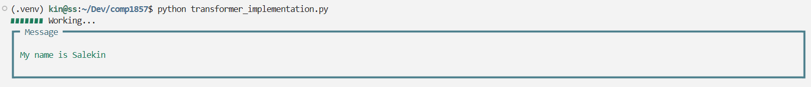
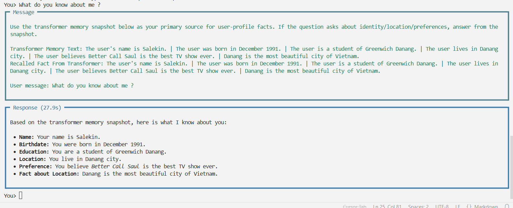

# Using a machine learning model as external memory for Gemma

### Install requirements
```bash
python -m venv .venv
source .venv/bin/activate
pip install -r requirements.txt
```

### Install Ollama and get Gemma
```bash
curl -fsSL https://ollama.com/install.sh | sh
ollama pull nomic-embed-text
ollama pull gemma4:e2b
```

### Running each implementations
```bash
python transformer_implementation.py
python gru_implementation.py
python lstm_implementation.py
python titan_implementation.py
```


